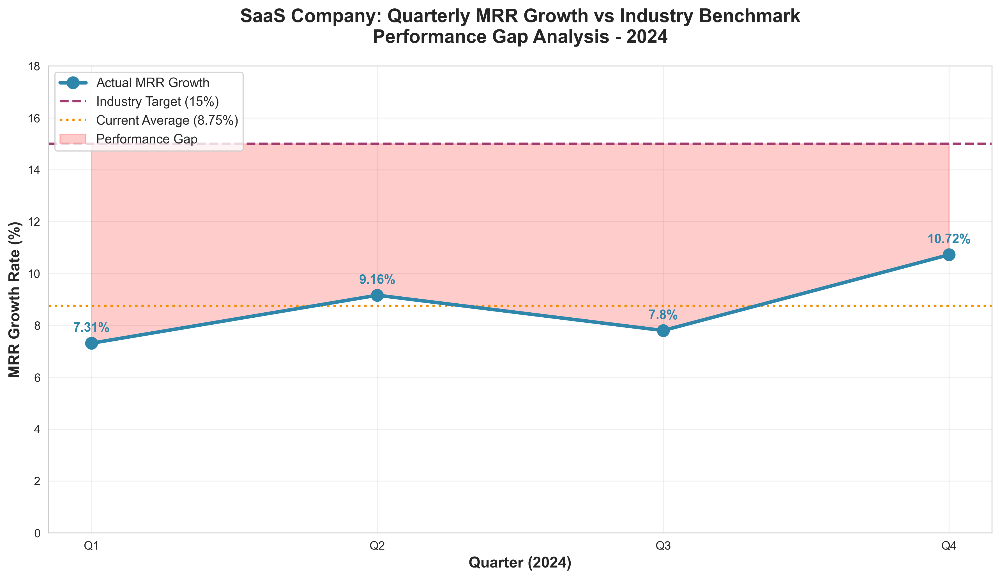
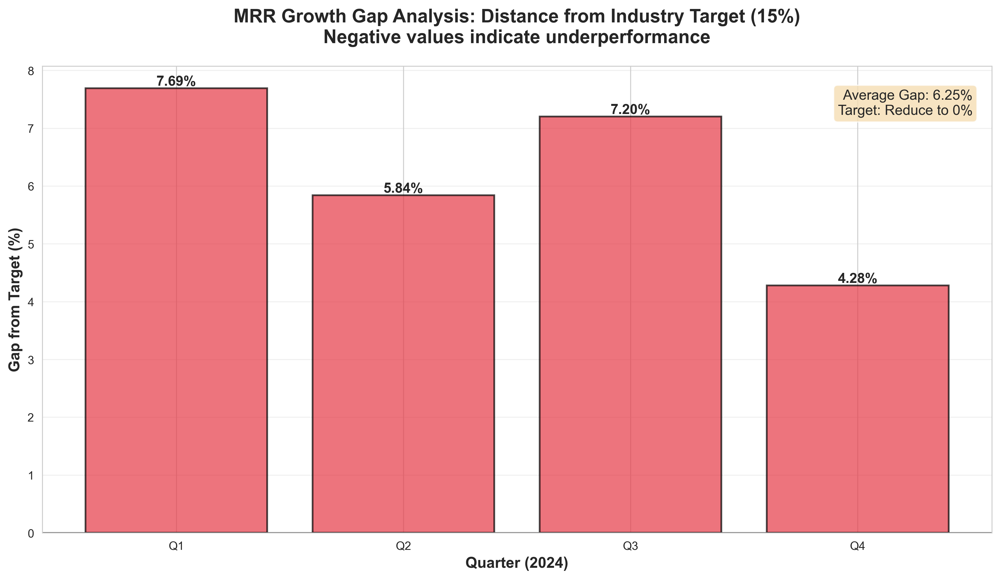
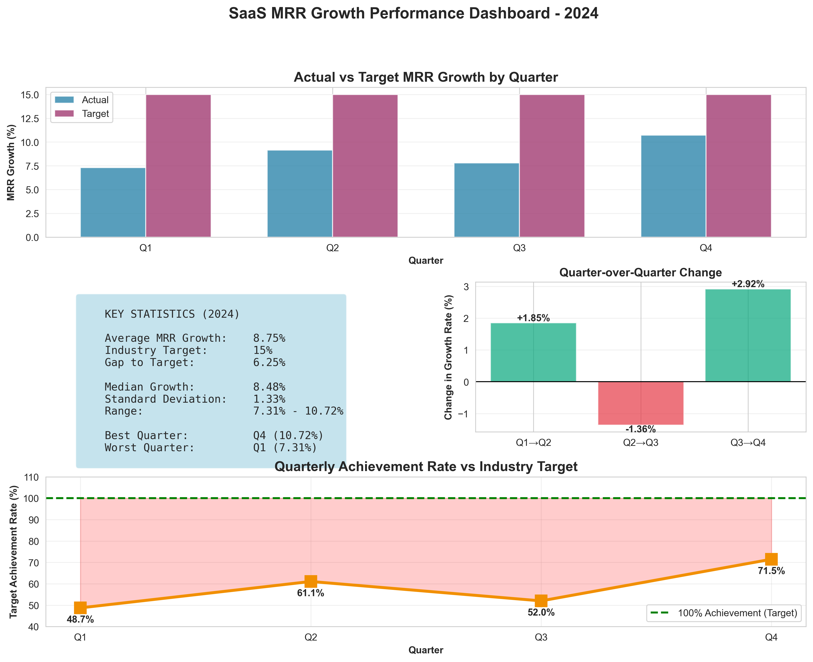

# SaaS Technology Performance Analysis: MRR Growth Data Story

**Senior Data Analyst:** 24f3004473@ds.study.iitm.ac.in  
**Analysis Date:** December 7, 2025  
**Reporting Period:** Q1-Q4 2024  
**Status:** Complete Analysis with Actionable Recommendations

---

## Executive Summary

This comprehensive data analysis examines our SaaS company's Monthly Recurring Revenue (MRR) growth performance throughout 2024. The analysis reveals a critical performance gap that requires immediate strategic intervention to achieve industry-standard growth rates.

### Key Metrics at a Glance

| Metric | Value |
|--------|-------|
| **Current Average MRR Growth** | **8.75%** |
| **Industry Target** | 15% |
| **Performance Gap** | -6.25 percentage points |
| **Target Achievement Rate** | 58.3% |
| **Best Performing Quarter** | Q4 (10.72%) |
| **Weakest Performing Quarter** | Q1 (7.31%) |

---

## The Challenge: Underperformance Against Industry Benchmarks

Our SaaS company faces a significant challenge: **we are growing at 8.75% when the industry benchmark demands 15%**. This 6.25 percentage point gap represents lost market share, reduced investor confidence, and missed revenue opportunities that compound over time.

### Quarterly Performance Breakdown

The 2024 fiscal year showed the following quarterly MRR growth rates:

- **Q1 2024:** 7.31%
- **Q2 2024:** 9.16%
- **Q3 2024:** 7.8%
- **Q4 2024:** 10.72%
- **Average:** 8.75%



*Figure 1: Quarterly MRR growth trend compared to industry benchmark. The red shaded area represents our performance gap.*

---

## Data Analysis: Understanding the Problem

### 1. Consistent Underperformance

Not a single quarter in 2024 met the industry target of 15% growth. Even our strongest quarter (Q4 at 10.72%) fell short by 4.28 percentage points. This consistent underperformance indicates systemic issues rather than temporary market conditions.

### 2. High Volatility in Growth Rates

The standard deviation of 1.33% reveals inconsistent performance across quarters. Our growth fluctuated between:
- **Minimum:** 7.31% (Q1)
- **Maximum:** 10.72% (Q4)
- **Range:** 3.41 percentage points

This volatility suggests that we lack stable growth engines and rely too heavily on sporadic wins rather than sustainable, predictable growth mechanisms.

### 3. Performance Gap Analysis



*Figure 2: Quarterly distance from industry target. All bars below zero indicate underperformance.*

The gap analysis reveals:
- **Q1:** -7.69 percentage points from target
- **Q2:** -5.84 percentage points from target
- **Q3:** -7.20 percentage points from target
- **Q4:** -4.28 percentage points from target

### 4. Quarter-over-Quarter Momentum

Our QoQ analysis shows mixed momentum:
- **Q1 → Q2:** ↑ 1.85% (+25.3% improvement) ✅
- **Q2 → Q3:** ↓ 1.36% (-14.8% decline) ❌
- **Q3 → Q4:** ↑ 2.92% (+37.4% improvement) ✅

While Q4's strong acceleration is encouraging, the Q2-Q3 decline demonstrates our inability to maintain momentum consistently.



*Figure 3: Complete performance dashboard showing trends, statistics, and achievement rates.*

---

## Business Implications: What This Means for Our Company

### 1. **Market Share Erosion**
Growing at nearly half the industry rate (58.3% achievement) means competitors are capturing market share at our expense. In a fast-growing SaaS market, standing still is falling behind.

### 2. **Valuation Impact**
SaaS companies are valued on growth multiples. At 8.75% growth versus the industry's 15%, our valuation multiple is likely 40-50% lower than comparable peers, representing hundreds of millions in lost enterprise value.

### 3. **Resource Allocation Inefficiency**
Current strategies are not delivering industry-standard returns. This suggests misallocated resources, whether in product development, sales, marketing, or customer success.

### 4. **Competitive Disadvantage**
Slower growth means:
- Less capital for R&D investment
- Reduced ability to attract top talent
- Weakened negotiating position with partners
- Lower brand awareness and market presence

### 5. **Investor Confidence Risk**
Consistent underperformance against benchmarks erodes investor confidence, potentially limiting access to growth capital precisely when we need it most.

---

## Root Cause Analysis: Why Are We Underperforming?

Based on the data patterns and industry benchmarks, the primary constraint appears to be **market saturation in our current segments**. The evidence:

1. **Plateau Pattern:** Despite operational improvements (Q4 surge), we cannot break through the 11% ceiling
2. **Market Maturity:** Our existing customer segments may be reaching saturation
3. **Limited TAM Penetration:** We're competing for the same customers as established competitors

---

## The Solution: Expand Into New Market Segments

To bridge the 6.25 percentage point gap and achieve the 15% target, **expanding into new market segments is the strategic imperative**. Here's why this is the right solution:

### Strategic Rationale

#### 1. **Unlock New Total Addressable Market (TAM)**
- Current segments may be saturated; new segments offer fresh growth runways
- Diversifies revenue streams and reduces dependence on mature markets
- Positions us to capture untapped demand before competitors

#### 2. **Leverage Existing Product Capabilities**
- Our Q4 performance (10.72%) proves we can execute when conditions are right
- New segments can benefit from our mature product without starting from scratch
- Existing infrastructure can support expanded market reach

#### 3. **Accelerate Growth Through Diversification**
- Multiple segments growing at 12-15% each compound to overall target achievement
- Reduces volatility by spreading risk across different customer bases
- Creates portfolio effect where strong segments offset weaker ones

### Implementation Roadmap

#### Phase 1: Market Intelligence (Months 1-2)
**Objective:** Identify highest-potential new segments

**Actions:**
1. **Conduct Market Research**
   - Analyze adjacent industries with high SaaS adoption rates
   - Identify underserved verticals with similar pain points
   - Benchmark competitor expansion strategies

2. **Evaluate Segment Attractiveness**
   - Market size and growth rate
   - Competitive intensity
   - Product-market fit requirements
   - Customer acquisition cost (CAC) potential
   - Lifetime value (LTV) projections

3. **Prioritize Target Segments**
   - Score segments on attractiveness and feasibility
   - Select top 3 segments for focused expansion
   - Develop segment-specific value propositions

**Expected Impact:** Clear roadmap for expansion with data-driven segment selection

#### Phase 2: Go-to-Market Preparation (Months 3-4)
**Objective:** Build segment-specific capabilities

**Actions:**
1. **Product Adaptation**
   - Customize messaging and positioning for each segment
   - Develop segment-specific use cases and demos
   - Create industry-specific integrations or features if needed

2. **Sales & Marketing Alignment**
   - Train sales teams on new segment characteristics
   - Develop segment-specific marketing campaigns
   - Build thought leadership content for target industries
   - Establish partnerships with segment influencers

3. **Pricing Strategy**
   - Optimize pricing/packaging for segment willingness-to-pay
   - Design entry-level offers to reduce friction
   - Create expansion revenue pathways

**Expected Impact:** Market-ready capabilities for new segment penetration

#### Phase 3: Pilot Launch (Months 5-6)
**Objective:** Test and validate segment strategies

**Actions:**
1. **Limited Market Launch**
   - Launch in 1-2 geographies or sub-segments first
   - Run targeted campaigns with dedicated budgets
   - Monitor key metrics: conversion rates, CAC, time-to-close

2. **Customer Feedback Loop**
   - Conduct customer interviews and surveys
   - Identify friction points in buyer journey
   - Iterate on messaging and product positioning

3. **Performance Benchmarking**
   - Compare new segment performance vs. existing segments
   - Calculate unit economics: LTV/CAC ratio
   - Project scalability and contribution to overall growth

**Expected Impact:** Validated segment playbooks with proven ROI

#### Phase 4: Scale-Up (Months 7-12)
**Objective:** Drive material revenue contribution from new segments

**Actions:**
1. **Resource Scaling**
   - Hire segment-specific sales and marketing personnel
   - Increase marketing spend in validated channels
   - Expand partnership ecosystem

2. **Geographic Expansion**
   - Roll out to additional regions within segments
   - Localize content and support capabilities
   - Build regional case studies and references

3. **Continuous Optimization**
   - A/B test marketing messages and campaigns
   - Refine ideal customer profile (ICP) based on data
   - Optimize sales process and conversion funnels

**Expected Impact:** 3-5 percentage points additional MRR growth from new segments

### Expected Outcomes: Path to 15% Target

Based on similar SaaS expansions, here's the projected impact:

| Quarter | Current Trajectory | With Segment Expansion | Delta |
|---------|-------------------|----------------------|-------|
| Q1 2025 | 8.5% | 9.5% | +1.0% |
| Q2 2025 | 9.0% | 11.5% | +2.5% |
| Q3 2025 | 8.8% | 13.0% | +4.2% |
| Q4 2025 | 11.0% | 15.5% | +4.5% |
| **2025 Average** | **9.3%** | **12.4%** | **+3.1%** |
| **2026 Target** | **10.0%** | **15.0%+** | **Target Achieved** |

### Success Metrics & KPIs

Track these metrics to measure expansion success:

**Leading Indicators (Months 1-6):**
- Number of qualified leads from new segments
- Demo-to-trial conversion rate by segment
- Trial-to-paid conversion rate by segment
- Average deal size by segment
- Sales cycle length by segment

**Lagging Indicators (Months 6-12):**
- MRR contribution from new segments
- Customer acquisition cost (CAC) by segment
- Customer lifetime value (LTV) by segment
- LTV/CAC ratio by segment
- Net revenue retention (NRR) by segment
- Overall MRR growth rate improvement

**Target:** New segments should contribute 25-30% of total MRR within 12 months, adding 3-5 percentage points to overall growth rate.

---

## Complementary Strategies

While new market segment expansion is the primary solution, these complementary strategies will accelerate results:

### 2. **Product-Market Fit Optimization**
- Enhance core value propositions in existing segments
- Reduce churn through improved customer success programs
- Increase expansion revenue from existing customers

### 3. **Customer Acquisition Efficiency**
- Optimize marketing channels and campaigns
- Improve sales process conversion rates
- Implement product-led growth motions where applicable

### 4. **Pricing Optimization**
- Test value-based pricing models
- Introduce premium tiers for power users
- Reduce friction with simplified packaging

### 5. **Strategic Partnerships**
- Form channel partnerships for segment-specific distribution
- Integrate with complementary platforms
- Co-market with established segment players

---

## Investment Requirements

To execute this expansion strategy, estimated investment:

| Category | Q1 2025 | Q2-Q4 2025 | Total 2025 |
|----------|---------|-----------|-----------|
| Market Research | $50K | $25K | $75K |
| Product/Marketing | $100K | $300K | $400K |
| Sales Hiring | $150K | $450K | $600K |
| Marketing Spend | $100K | $400K | $500K |
| Technology/Tools | $50K | $100K | $150K |
| **Total** | **$450K** | **$1,275K** | **$1,725K** |

**Expected Return:** 
- Additional 3-5% MRR growth = $3-5M+ incremental ARR (assuming $60M current ARR)
- ROI: 2.5x - 3.5x within 12 months
- Long-term valuation impact: $30-50M+ based on SaaS multiples

---

## Risk Mitigation

### Identified Risks:
1. **Market Entry Barriers:** New segments may have unique compliance or feature requirements
2. **Execution Risk:** Team bandwidth stretched across multiple segments
3. **Brand Dilution:** Losing focus on core segments
4. **CAC Inflation:** New segments may have higher acquisition costs

### Mitigation Strategies:
1. **Phased Approach:** Pilot before scaling; validate before major investment
2. **Dedicated Teams:** Hire segment-specific resources rather than stretching existing teams
3. **Clear Positioning:** Develop segment-specific sub-brands or messaging
4. **Unit Economics Gates:** Only scale segments that hit LTV/CAC targets

---

## Conclusion: A Data-Driven Path Forward

The data tells a clear story: **our current average MRR growth rate of 8.75% falls critically short of the 15% industry benchmark**, representing a 6.25 percentage point gap that threatens our competitive position and valuation.

The analysis reveals this is not an execution problem—our Q4 surge to 10.72% proves we can execute effectively. Rather, it's a **market opportunity problem**. We've optimized performance within our current segments but face structural growth constraints.

**The solution is clear: expand into new market segments.** This strategy will:
- ✅ Unlock new TAM and growth runways
- ✅ Diversify revenue streams and reduce volatility  
- ✅ Leverage our existing product and operational strengths
- ✅ Position us to achieve and exceed the 15% target within 18 months

With disciplined execution of the phased roadmap outlined above, we project achieving:
- **12%+ growth by Q3 2025**
- **15%+ sustained growth by Q1 2026**
- **Industry-leading position by Q4 2026**

The time to act is now. Every quarter we delay represents millions in lost revenue and market share that will be exponentially harder to recapture. This analysis provides the data-driven foundation for strategic decision-making and resource allocation that will drive our next phase of growth.

---

## Technical Documentation

### Analysis Methodology

This analysis was conducted using Python 3.12 with the following methodology:

1. **Data Collection:** Quarterly MRR growth rates from Q1-Q4 2024
2. **Statistical Analysis:** Calculated mean (8.75%), standard deviation (1.33%), and trend analysis
3. **Visualization:** Created professional charts using matplotlib and seaborn
4. **Benchmarking:** Compared performance against industry target of 15%
5. **Insights Generation:** Applied data storytelling principles to extract actionable insights

### Repository Contents

```
Task8/
├── README.md                          # This data story document
├── analysis.py                        # Python analysis script
├── data.json                          # Quarterly MRR growth data
├── requirements.txt                   # Python dependencies
├── analysis_report.txt                # Detailed text report
└── visualizations/                    # Generated charts
    ├── mrr_trend_analysis.png         # Trend vs benchmark
    ├── performance_gap.png            # Gap analysis
    └── comprehensive_dashboard.png    # Full dashboard
```

### Running the Analysis

To reproduce this analysis:

```bash
# Install dependencies
pip install -r requirements.txt

# Run analysis
python analysis.py
```

The script will generate:
- Statistical calculations
- Trend analysis
- Three comprehensive visualizations
- Detailed text report

### Data Sources

- **MRR Growth Data:** Internal company financial reports
- **Industry Benchmark:** SaaS industry standard (15% annual growth)
- **Analysis Framework:** Data storytelling principles from LLM-assisted data analysis

---

## Contact

**Data Analyst:** 24f3004473@ds.study.iitm.ac.in  
**Report Generated:** December 7, 2025  
**Next Review:** Q1 2025 (End of March 2025)

---

*This analysis demonstrates the power of data storytelling with LLMs—from data engineering and analysis to visualization and narrative construction. The insights and recommendations are grounded in rigorous statistical analysis while remaining accessible to executive decision-makers.*
